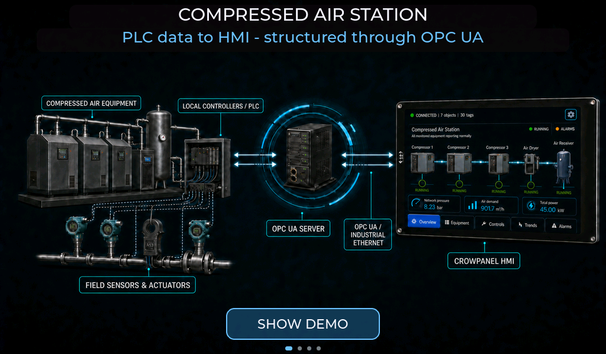

# OpenPLC CrowPanel

This package is for **CrowPanel Advanced ESP32-P4 v1.2, 7-10 inch models**. It runs entirely on the panel. Wi-Fi, an OPC UA server, and configuration are not required.

## Read before flashing

Start with the document that matches what you want to learn:

- [User Manual](USER_MANUAL.md) - how to use the interface, screens, controls, alarms, settings, and suggested actions.
- [System Overview](SYSTEM_OVERVIEW.md) - how the application is structured and how data moves between the station model, Data Model, controls, trends, alarms, and generated UI.

## Flash the panel

1. [Download the ZIP package](OpenPLC-Crowpanel%20v1.4.zip).
2. Connect the cable to the panel's **UART connector** and to your Windows PC.
3. Close any serial monitor or other program that may be communicating with the panel.
4. Run `Firmware_Flasher.exe`.
5. Keep the panel connected until `Flashing completed successfully` appears.
6. Press Enter to close the flasher. The panel restarts and opens the application automatically.

Windows may ask you to confirm the downloaded application. Continue only if the package came from this repository.

## If the panel is not detected

- Check that the cable is connected correctly to the panel's UART connector and the computer.
- Close any application that may be communicating with the panel.
- Disconnect and reconnect the cable, then run the flasher again.
