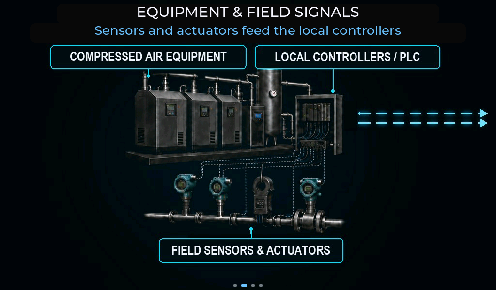
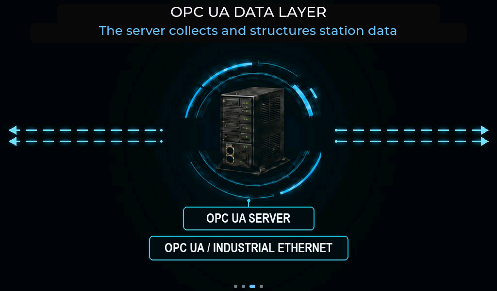
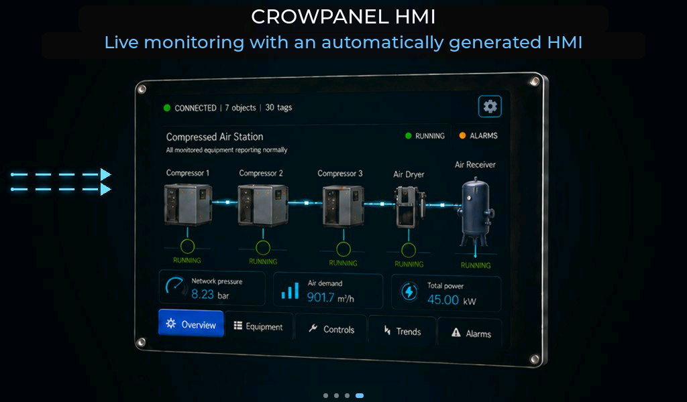

# OpenPLC CrowPanel - System Overview

OpenPLC CrowPanel is an industrial HMI for **CrowPanel Advanced ESP32-P4 v1.2, 7-10 inch models**. It converts structured OPC UA data into a complete operator interface without manually configured equipment screens.

## Architecture


```text
Sensors / Actuators <-> PLC or Equipment Controller
                              |
                              v
                        OPC UA Server
                              |
                       Industrial Ethernet
                              |
                              v
                open62541 OPC UA Client
                              |
                              v
                         Data Model
                              |
                              v
                    Generated LVGL HMI
       Overview | Equipment | Controls | Trends | Alarms
```

The application is divided into independent communication, data, and presentation layers. The OPC UA Client browses the server Address Space, reads equipment metadata and access rights, subscribes to live values, and writes operator commands.

The current version also includes an Embedded Station Runtime. It provides a complete compressed-air station directly on the panel and uses the same Data Model and generated interface as the OPC UA data path.

## Data Model

 

The Data Model is the shared layer between the data source and the UI. It stores:

- the equipment hierarchy and NodeIds;
- readable measurements and operating states;
- writable commands and access rights;
- data types, engineering units, and value ranges;
- active alarms, sources, and severity.

The transport layer updates the model, while every HMI page observes it. This keeps communication logic separate from visualization and ensures that all screens present the same system state.

## Automatic UI generation



The UI Generator creates LVGL widgets from the discovered model:

- **Overview** selects key process values and equipment states.
- **Equipment** presents detailed readable data for each asset.
- **Controls** contains variables with write access.
- **Trends** builds rolling charts for numeric values.
- **Alarms** shows active conditions with source, reason, and severity.

Objects, variables, data types, semantic roles, and access rights determine what appears on each page. The interface is therefore reusable across different OPC UA equipment structures.

## Live data and commands

```text
OPC UA Subscription -> Data Model -> HMI Update
Touch Control -> Data Model -> OPC UA Write
```

Subscriptions deliver value changes without rebuilding the interface. A single update can refresh equipment state, Overview indicators, trends, and alarms at the same time.

Operator actions follow the reverse path. The client writes the selected command to the corresponding OPC UA Variable, and the resulting process state returns through the normal live-data flow. With the Embedded Station Runtime, the same command and update cycle remains local to the panel.

## Alarms and trends

Alarms use their source, reason, severity, and active state. The shared alarm model keeps status indicators and the Alarms page synchronized.

Trends are generated for readable numeric values and retain approximately 60 seconds of recent data. They use the same live updates as the rest of the HMI, without a separate configuration step.

## Modular design

Communication, Data Model, UI generation, trends, alarms, navigation, and system settings are separate modules. This keeps the application easy to extend and allows the data source or equipment structure to change without redesigning the interface.
